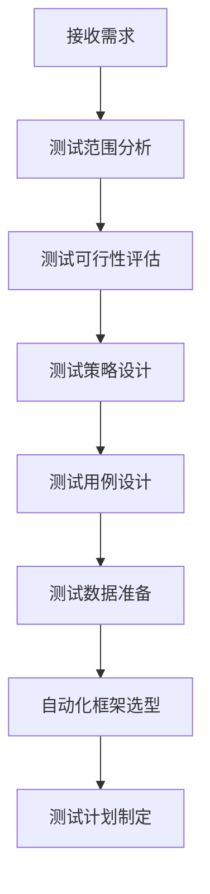
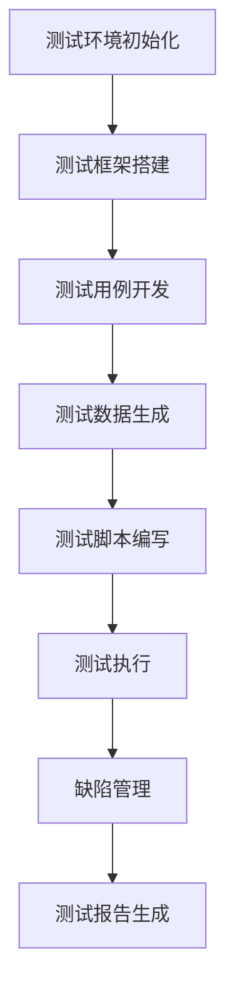
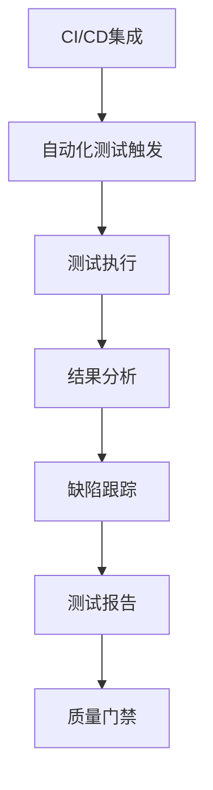

# 自动化测试工程师综合指南

## 一、测试核心流程

### 1.1 需求分析与测试设计


### 1.2 测试实施流程


### 1.3 持续测试流程


## 二、测试指导原则

### 2.1 代码质量原则
- **PEP8规范**：统一代码风格
- **DRY原则**：通过函数和模块复用减少重复
- **可维护性**：清晰的测试结构和注释
- **类型提示**：使用Type Hints提高代码可读性

### 2.2 测试设计原则
- **分层测试**：单元测试、集成测试、系统测试
- **数据驱动**：分离测试逻辑与测试数据
- **并行执行**：支持测试用例并行执行
- **可重复性**：测试结果可稳定复现

## 三、强制执行规则

### 3.1 代码规范要求
1. **PEP8合规**：必须通过flake8检查
2. **文档规范**：测试方法必须包含docstring
3. **断言规范**：使用明确的断言方法
4. **日志记录**：关键测试步骤需记录日志

### 3.2 测试覆盖率要求
1. **核心模块**：单元测试覆盖率≥80%
2. **接口测试**：主要接口测试覆盖率100%
3. **场景覆盖**：关键业务场景全覆盖
4. **边界测试**：边界条件必须测试

## 四、最佳实践

### 4.1 单元测试规范
```python
def test_addition():
    """测试加法运算"""
    assert add(2, 3) == 5
    assert add(-1, 1) == 0
```

### 4.2 API测试规范
```python
def test_user_login():
    """测试用户登录接口"""
    response = client.post('/login', json={
        'username': 'test',
        'password': '123456'
    })
    assert response.status_code == 200
    assert 'token' in response.json()
```

### 4.3 UI自动化规范
```python
def test_homepage():
    """测试首页加载"""
    driver.get('http://localhost:8000')
    assert 'Welcome' in driver.title
    assert driver.find_element(By.ID, 'logo')
```